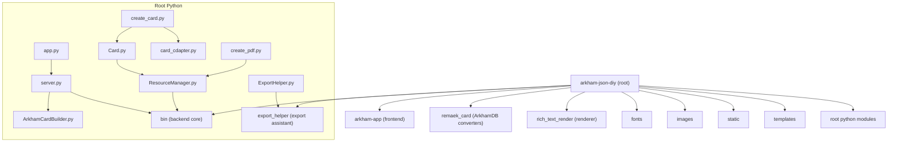

# CLAUDE.md

## 变更记录 (Changelog)

- **2025-11-06**:
  - 前端：新增TextBoundaryEditor组件，支持正文边界和风味文本padding调整
  - 前端：CardSideEditor添加可收展的插画布局设置按钮（默认收起）
  - 后端：create_card.py添加flavor_padding参数支持，可配置风味文本内边距（默认20px）
  - 后端：所有draw_text调用添加boundary_offset参数，支持文本框边界精确调整
  - i18n：更新中英文本地化资源，添加TextBoundaryEditor和插画布局相关翻译
- **2025-10-17**: 完成三阶段自适应扫描，更新模块结构图，发现并文档化remaek_card模块
- **2025-10-12**: 初始化AI上下文，完成项目结构分析

## Purpose

arkham-json-diy 提供一套完整的“阿卡姆恐怖 LCG”自定义制卡工作流：
- 前端（Vue 3 + TypeScript + Vite）用于卡牌设计、编辑与管理。
- 后端（Python + Flask + PyWebview）负责渲染、资源管理与导出。
- 渲染内核（Pillow + rich_text_render）支持中英混排、图文混排与版式布局。
- 导出助手（export_helper）提供 AI 出血/镜像延伸，面向高质量打印与 TTS。

## Structure

项目采用前后端分离与多模块协作：



## Components

目录级模块一览（汇总子目录 CLAUDE.md）：

| 模块路径 | 语言/类型 | 职责描述 | 入口/关键文件 | 文档 |
|---------|-----------|----------|---------------|------|
| arkham-app | TypeScript/Vue | 前端 UI：卡牌设计、编辑、管理与导出 | `src/main.ts` | [`arkham-app/CLAUDE.md`](arkham-app/CLAUDE.md) |
| bin | Python | 后端核心业务：文件/工作空间、卡组导出、TTS转换、图床 | `file_manager.py`, `workspace_manager.py` | [`bin/CLAUDE.md`](bin/CLAUDE.md) |
| export_helper | Python | 高质量导出：AI 出血（lama-cleaner）与镜像延伸 | `main.py`, `LamaCleaner.py` | [`export_helper/CLAUDE.md`](export_helper/CLAUDE.md) |
| remaek_card | Python | ArkhamDB 数据转换与本地卡牌生成脚本 | `main.py`, `remaek_player_card.py` | [`remaek_card/CLAUDE.md`](remaek_card/CLAUDE.md) |
| rich_text_render | Python 包 | 富文本解析与排版渲染（Pillow） | `HtmlTextParser.py`, `RichTextRenderer.py` | [`rich_text_render/CLAUDE.md`](rich_text_render/CLAUDE.md) |
| static | Web 静态资源 | 构建产物（静态站点与 hashed 资源） | `index.html`, `assets/` | [`static/CLAUDE.md`](static/CLAUDE.md) |
| fonts | 资源 | 多语言字体与映射配置 | `language_config.json` | [`fonts/CLAUDE.md`](fonts/CLAUDE.md) |
| images | 资源 | 卡面模板与出血版本（命名规范驱动选择） | `*.png` | [`images/CLAUDE.md`](images/CLAUDE.md) |
| templates | TTS 模板 | TTS 对象模板（General/Act/Investigator/Box） | `*.json` | [`templates/CLAUDE.md`](templates/CLAUDE.md) |
| prompt | 文本/脚本 | 辅助提示与脚本片段 | `player_card_picture.txt` | [`prompt/CLAUDE.md`](prompt/CLAUDE.md) |

根级 Python 模块索引（按导入关系归纳）：

| 文件 | 角色概述 | 关键依赖 |
|------|----------|----------|
| `app.py` | 桌面启动器（PyWebview）与后端整合 | `server`, `webview`, `argparse` |
| `server.py` | Flask API 服务（路由、线程、平台集成） | `flask`, `ArkhamCardBuilder`, `webview`, `PIL` |
| `ArkhamCardBuilder.py` | 制卡协调器：调度资源与管线 | `requests`, `bin`, `json`, `pathlib` |
| `Card.py` | 单卡渲染核心：文本/图文混排 | `PIL`, `rich_text_render`, `ResourceManager` |
| `create_card.py` | 制卡脚本入口与流程 | `Card`, `card_cdapter`, `PIL` |
| `card_cdapter.py` | 文本/标记预处理与适配 | `re`, `json`, `ResourceManager` |
| `create_pdf.py` | 批量导出 PDF | `reportlab`, `PIL`, `ResourceManager` |
| `ResourceManager.py` | 资源路径与配置桥接 | `bin`, `json`, `os` |
| `ExportHelper.py` | 导出桥接（封装 export_helper 包） | `export_helper`, `numpy`, `PIL` |
| `macapp.py` | macOS 打包/壳逻辑 | `webview`, `requests`, `server` |
| `main.py` | Android/Kivy 入口（移动端） | `kivy`, `jnius`, `android`, `server` |
| `setup.py` | Python 包装与分发 | `setuptools` |
| `dmg_settings.py` | macOS DMG 配置 | `os` |

> 注：以上概述依据实际源码与 AST 导入分析自动归纳，详细请查阅各文件与子模块文档。

## Dependencies

- Python 栈：`flask`, `Pillow(PIL)`, `reportlab`, `requests`, `numpy`, `webview`,（可选移动端）`kivy`, `jnius`, `android`
- Node 栈（前端）：Vue 3、Vite、TypeScript、Naive UI、Vue I18n、Axios
- 外部服务：`lama-cleaner`（export_helper 的 AI 出血服务，可降级为本地镜像扩展）
- 配置/数据：`global_config.json`, `recent_directories.json`（根级）；前端 `package.json`/`vite.config.ts`
- 打包/构建：`app.spec`, `app-macos.spec`, `buildozer.spec`

## Integration

- 前后端交互：`arkham-app` 通过 REST API 调用 `server.py`；后端调度 `ArkhamCardBuilder` → `Card`/`ResourceManager` 完成渲染。
- 渲染链路：HTML-like 文本 → `rich_text_render` 解析与排版 → Pillow 绘制 → PNG/JPG →（可选）`create_pdf.py` 合成 PDF。
- 导出链路：生成卡面 → `ExportHelper.py`/`export_helper` → `lama-cleaner` 出血或镜像延伸 → 输出到工作目录 `output/`。
- 数据转换：`remaek_card` 将 ArkhamDB 数据/编号映射到本地制卡 JSON/资产。
- 静态发布：前端构建产物写入 `static/`，由后端静态路由或外部服务器提供。

## Notes

- 文件/资源路径尽量相对化，便于跨平台迁移；确保所有文本与 JSON 使用 UTF‑8（含中文）。
- 图片模板命名遵循严格模式（类型/职业/等级/副标题等），以支持程序化选择与自动对齐。
- 资源较大操作（出血、PDF 合成）建议批处理并关注内存/显存占用。
- 模块级详细文档请参考对应子目录的 `CLAUDE.md`（见上表与结构图中的点击链接）。

## 项目愿景

阿卡姆印牌姬 (arkham-json-diy) 是一个专为Arkham Horror卡牌游戏设计的自定义工具项目。它提供了一个强大的卡牌生成和管理平台，支持多种卡牌类型的创建、编辑和导出，特别是为Tabletop Simulator (TTS)提供优化支持。

## 架构总览

本项目采用前后端分离的架构：
- **前端**: Vue 3 + TypeScript + Vite + Naive UI，提供现代化的用户界面
- **后端**: Python Flask + PyWebview，负责卡牌渲染、文件管理和导出功能
- **核心功能**: 支持调查员卡、技能卡、支援卡、事件卡、弱点卡和升级卡等多种卡牌类型的生成

### 技术栈

- **前端技术**:
  - Vue 3 (Composition API + `<script setup>`)
  - TypeScript
  - Vite (构建工具)
  - Naive UI (UI组件库)
  - Vue I18n (国际化)
  - Axios (HTTP客户端)

- **后端技术**:
  - Python 3.9+
  - Flask (Web框架)
  - PyWebview (桌面应用封装)
  - PIL/Pillow (图像处理)
  - ReportLab (PDF生成)

## ✨ 模块结构图


## 模块索引

| 模块路径 | 语言 | 职责描述 | 入口文件 | 测试目录 | 配置文件 |
|---------|------|---------|----------|----------|----------|
| arkham-app | TypeScript/Vue | 前端用户界面，提供卡牌设计、编辑和管理功能 | src/main.ts | - | package.json, vite.config.ts |
| bin | Python | 后端核心业务逻辑，包含文件管理、工作空间管理等功能 | - | - | - |
| export_helper | Python | 高级导出功能，支持AI出血和图像处理优化 | main.py | - | - |
| remaek_card | Python | 卡牌数据转换和处理模块，支持ArkhamDB数据转换 | main.py | - | - |
| 核心模块 | Python | 应用程序主入口和服务器逻辑 | app.py, server.py | - | config.json |

## 运行与开发

### 环境要求
- Python 3.9+
- Node.js 16+ (用于前端开发)
- 必要的字体文件 (fonts/)
- 图片模板资源 (images/)

### 启动方式

1. **完整应用启动** (推荐):
   ```bash
   python app.py
   ```

2. **前端开发模式**:
   ```bash
   cd arkham-app
   npm install
   npm run dev
   ```

3. **仅后端服务器模式**:
   ```bash
   python server.py
   ```

### 开发工作流

1. **前端开发**:
   - 在 `arkham-app` 目录下使用 `npm run dev` 启动开发服务器
   - 前端通过代理与后端Flask服务通信 (localhost:5000)
   - 支持热重载和TypeScript类型检查

2. **后端开发**:
   - 直接运行 `python app.py` 启动完整应用
   - 或使用 `python server.py` 仅启动后端服务
   - 支持调试模式 (`-d` 参数)

## 测试策略

- **前端**: Vue组件单元测试 (待实现)
- **后端**: Python单元测试 (待实现)
- **集成测试**: 前后端接口测试 (待实现)
- **E2E测试**: 端到端功能测试 (待实现)

## 编码规范

### Python规范
- 遵循PEP 8编码规范
- 使用类型提示 (Type Hints)
- 函数和类需要包含文档字符串

### TypeScript/Vue规范
- 使用TypeScript严格模式
- 遵循Vue 3 Composition API最佳实践
- 使用 `<script setup>` 语法
- 组件命名采用PascalCase

## AI使用指引

### 项目理解要点

1. **核心功能**:
   - 卡牌生成基于JSON数据和模板图片
   - 支持多种Arkham Horror卡牌类型
   - 提供高级导出功能，包括AI出血处理

2. **前后端交互**:
   - 前端通过RESTful API与后端通信
   - 文件操作通过Flask后端处理
   - 使用统一的数据交换格式

3. **关键模块**:
   - `Card.py`: 卡牌渲染核心逻辑
   - `create_card.py`: 卡牌生成处理器
   - `bin/workspace_manager.py`: 工作空间管理
   - `arkham-app/src/api/`: 前端API服务层
   - `remaek_card/`: ArkhamDB数据转换和卡牌处理

### 开发建议

1. **添加新功能时**:
   - 先了解现有的数据模型和API结构
   - 遵循前后端分离的开发模式
   - 确保添加适当的错误处理和类型定义

2. **修改卡牌类型时**:
   - 需要同时修改前端UI和后端渲染逻辑
   - 注意保持数据结构的一致性
   - 更新相关的模板和配置文件

3. **性能优化**:
   - 图片处理操作可能较耗时，考虑异步处理
   - 前端组件按需加载，避免一次性渲染大量卡牌
   - 合理使用缓存机制

## 重要提示

- 所有文件操作都限制在工作空间目录内，确保安全性
- 图片资源路径使用相对路径，便于项目移植
- 配置文件 (`config.json`) 会在首次运行时自动生成
- 项目支持中英双语，新增文本需要注意国际化处理
