# Arkham Card Maker User Guide (2025 Edition)

## Table of Contents

1. [Quick Start (Download, First Run, Workspace)](#1-quick-start)
2. [UI Overview (Home and Workspace Layout)](#2-ui-overview)
3. [Basic Features (Editing, Rich Text, Assets, Export)](#3-basic-features)
4. [Content Packages (Encounter Sets, Auto Numbering, ArkhamDB/TTS/PNP)](#4-content-packages)
5. [Advanced Features (Layout, TTS Script, Image Host, DeckBuilder)](#5-advanced-features)
6. [FAQ (Performance, Printing, Permissions & Network)](#6-faq)

---

## 1. Quick Start

### 1.1 Download and Installation

This guide only covers running on Windows and macOS. Source builds and Android are out of scope.

- Windows (recommended)
  1. Go to GitHub Releases and download the latest version.
  2. Extract it to a path without spaces or special characters.
  3. Double-click `Arkham Card Maker.exe` to start.
  4. If Windows Defender blocks the app, click **More info** → **Run anyway**.

- macOS (arm64 / x86_64)
  1. Download the `.dmg` that matches your CPU architecture.
  2. Open the `.dmg` and drag the app into `Applications`.
  3. On first run, right-click the app → **Open** and confirm the Gatekeeper prompt once.

### 1.2 First Run and Workspace Selection

On launch you will see the **Home** page with:

- **Recent Workspaces** – up to 20 recent workspace directories (maintained by the backend QuickStart service).
- **Select Directory** – open or create a workspace directory.
- **Language Switch** – switch between Chinese and English UI.
- **Service Status** – Flask backend status and version.

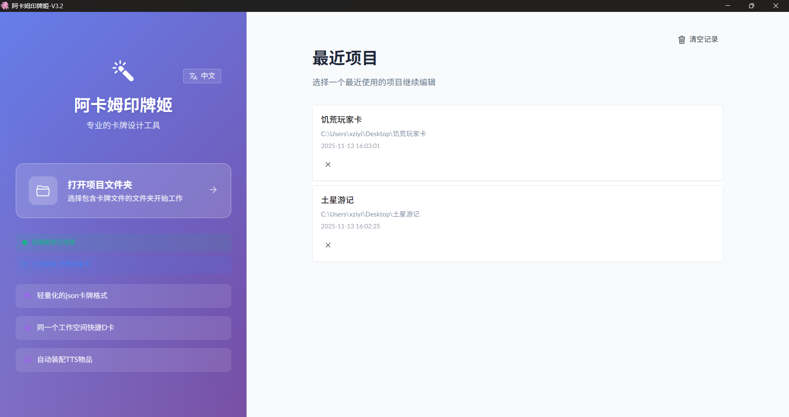

To open a workspace:

1. Click `Select Directory`.
2. Choose or create an empty directory.
3. Confirm to enter the workspace main view.

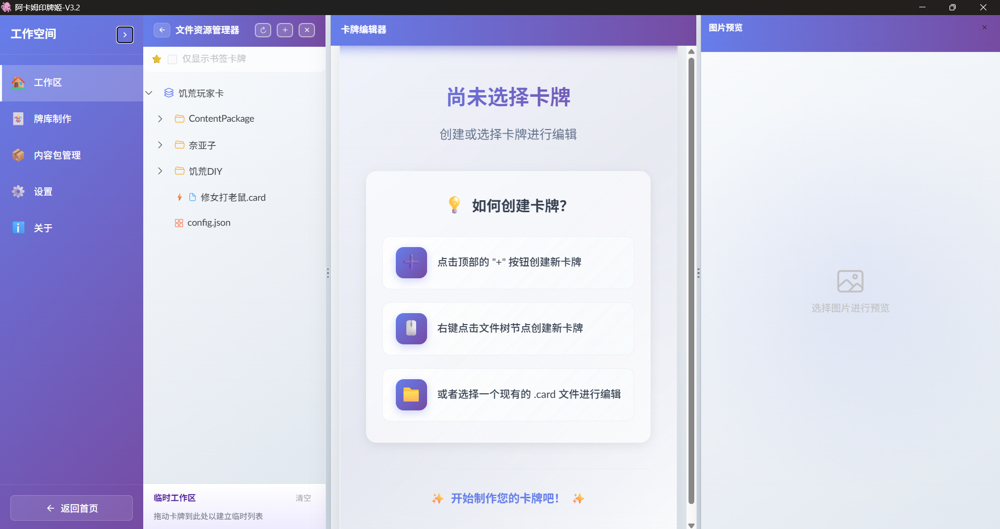

Large workspace scanning behavior:

- The file tree is built in two phases: **structure first + async type scanning**. The directory structure appears almost instantly, then card types and preview information are filled in gradually.
- The top toolbar shows scan progress, powered by `/api/workspace/scan-progress/<scan_id>`.

### 1.3 Create Your First Card

1. In the left file tree, right-click a target folder → **Create File** → enter a name such as `example.card`.
2. Once selected, the center form automatically matches the card type and renders the fields.
3. The right pane shows a live card preview; you can export PNG / JPG / PDF at any time.

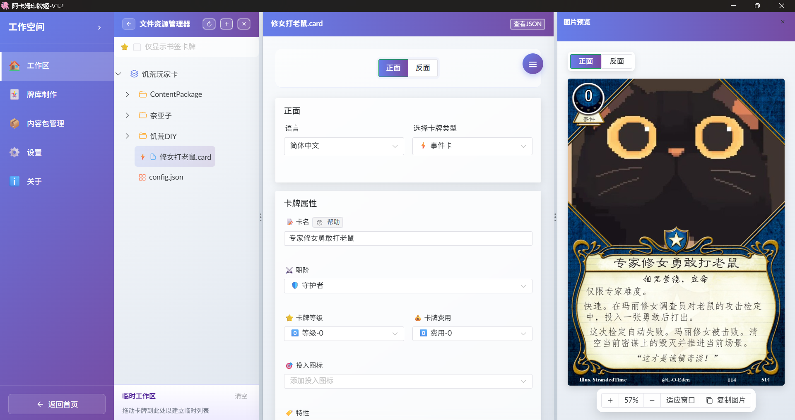

---

## 2. UI Overview

### 2.1 Home Page

- Quick actions: select workspace, switch language.
- Recent workspaces: click to open; right-click to remove from the list.

### 2.2 Workspace Layout (Three-Column View)

- Left: **File Tree** panel
  - Quick actions: create / rename / delete / refresh.
  - Search box: filter by name or card type.
  - Virtual scrolling: smooth navigation even for very large projects.
  - Type indicator: `.card` / `.card.json` nodes show specific card-type icons.
- Center: **Card Editor** (form driven)
  - Dynamic fields: fields change with the card type.
  - Validation: required fields and type constraints.
  - Rich text: HTML-like markers and icon placeholders.
- Right: **Live Preview & Export**
  - Zoom and fit-to-window.
  - Front/back toggle for double-sided cards.

---

## 3. Basic Features (15+ Core Capabilities)

This section covers the high-frequency actions in daily card creation, from editing to export.

### 3.1 Files and Directories

1. Create a directory: right-click in the file tree → `New Folder` → rename → press Enter.
2. Create a card: right-click → `New Card` → enter file name and press Enter.
3. Rename / delete: right-click the item → choose the operation → confirm.

Naming suggestion:

```text
workspace/
├─ Investigators/
├─ Assets/
├─ Events/
├─ Skills/
└─ Scenarios/
   ├─ Scenario1/
   └─ Scenario2/
   └─ UtilityEncounter/
```

### 3.2 Form Editing

- Dynamic fields: driven by the frontend `cardTypeConfigs.ts` (20+ card types).
- Field types: text, number, select, file picker, rich text.

### 3.3 Rich Text and Icons

Click the help button next to a text field to see supported rich-text markers and icons.

Example:

```text
<Free> If you are not engaged with any enemy and there is an adjacent location without a ready enemy, spend 1 resource: move to that location.
```

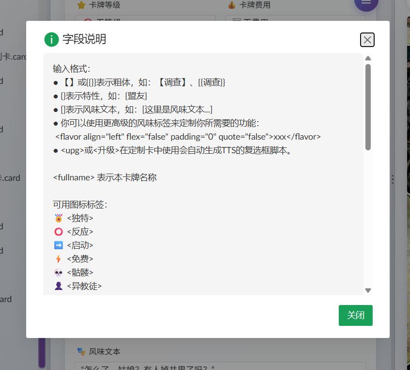

### 3.4 Illustration Layout and Text Boundaries (Advanced Layout Control)

#### 3.4.1 Illustration Layout Editor

Purpose: precisely control image scaling, cropping, rotation and offset.

Usage:

1. In the card editor, locate the `Illustration` field.
2. Click the `Advanced Layout` button.
3. In the popup editor adjust:
   - **Scale**: 0.5–2.0 (1.0 = original size).
   - **Crop**: top / bottom / left / right margins as percentages (0–100%).
   - **Rotation**: -180° to 180°.
   - **Flip**: horizontal / vertical.
   - **Offset**: X/Y pixel offset.
4. Preview the result in real time.
5. Click `Apply` to save.

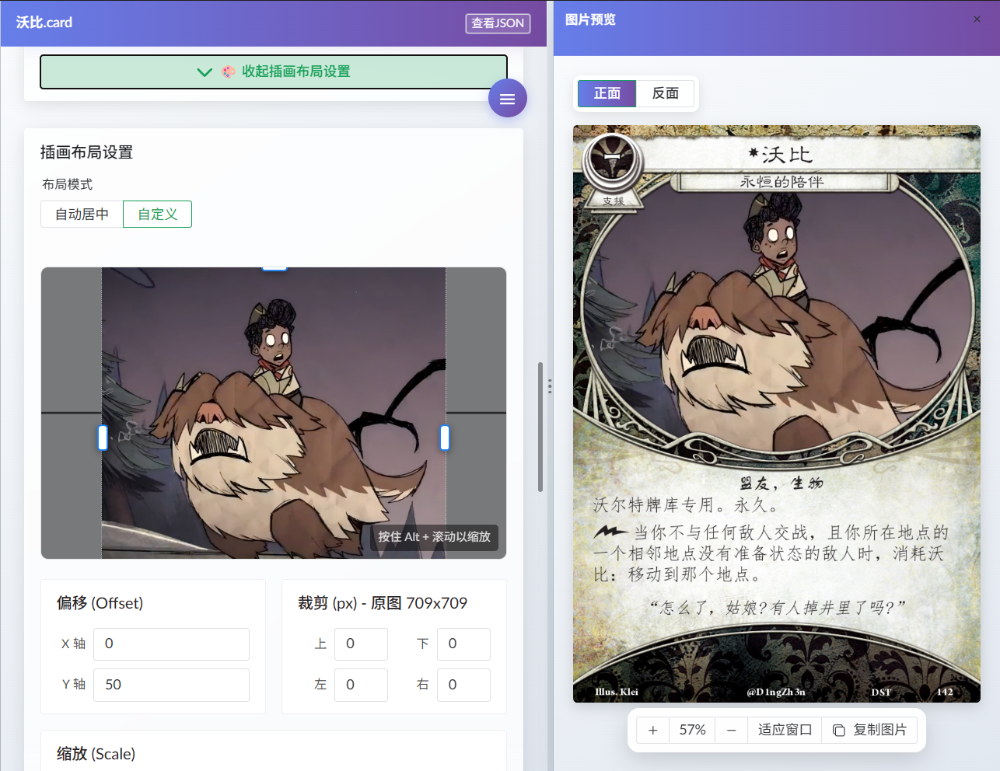

Typical use cases:

- Re-center the focus of an illustration.
- Crop out unwanted borders.
- Rotate landscape artwork.
- Optimize composition for circular cutouts or special frames.

#### 3.4.2 Text Boundary Editor

Purpose: define the shape and position of the text region (supports polygonal regions).

Usage:

1. In the card editor, locate the `Card Text` field.
2. Click the `Edit Text Boundary` button.
3. In the popup editor:
   - Visual editing: drag control points to adjust the polygon.
   - Numeric input: enter coordinates precisely (pixels).
   - Presets: rectangle / trapezoid / custom.
4. Preview the text layout.
5. Click `Apply` to save.

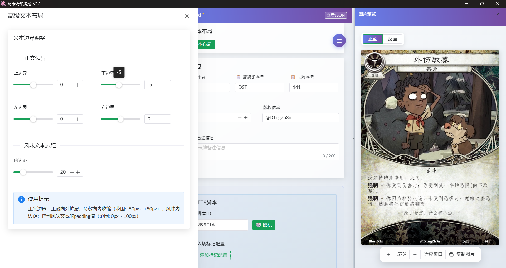

Typical use cases:

- Adapt to irregular templates (e.g., hex-shaped text areas on location cards).
- Avoid overlapping important parts of the illustration.
- Create unique layout effects.

### 3.5 Single-Card Export (PNG/JPG/PDF)

Quick export: click `Quick Export` in the bottom area of the editor.

Advanced export: right-click a card object and choose `Advanced Export`.

Options:

- Format: PNG (lossless) / JPG (smaller file size).
- Size: four predefined sizes; official card size is 61.5 mm × 88 mm.
- Bleed: 0 / 2 / 3 mm (for printing).

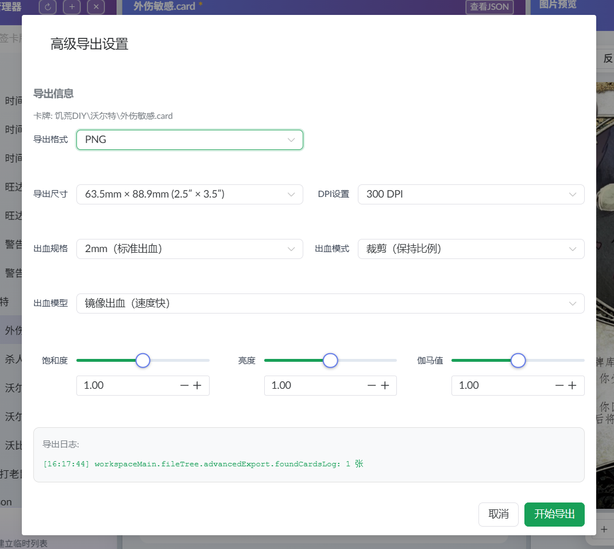

### 3.6 Batch Export

Multi-select cards in the file tree (`Ctrl` / `Cmd`), then right-click and choose `Advanced Export` → apply the same parameters → start and monitor progress in the notification area.

### 3.7 Encounter Icons and Expansion Icons

- **Encounter set icons**: create a directory in your workspace to store encounter set icons. Put your transparent PNGs there (ideally named after the encounter set). Then choose that directory in `Encounter Icon Directory` in settings to use them in the editor.
- **Expansion icons**: these icons appear at the bottom right of the card. Place a transparent square image (1:1 ratio) in the workspace, then select it in `Expansion Icon` in settings to apply globally.
- **Global copyright**: at the bottom of the form, fill in a short copyright text, e.g. `© 2025 DIY`.

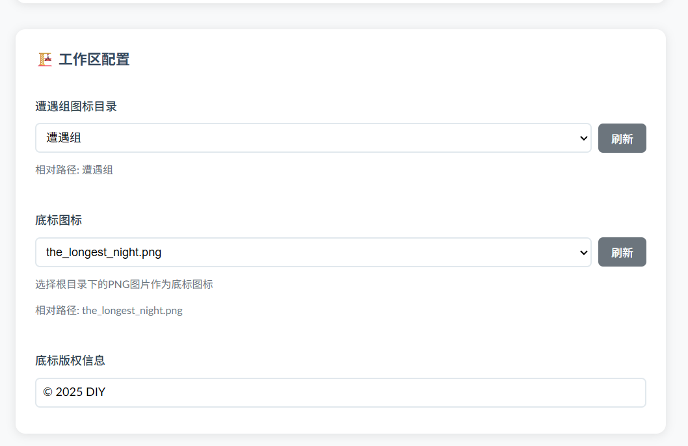

### 3.8 Favorites and Temporary Workspace

- **Favorites**: right-click a card in the file tree → `Add to Favorites` to pin frequently used or in-progress cards.
- **Temporary workspace**: drag the cards you are actively editing into the temporary workspace area at the bottom to jump between them across folders.

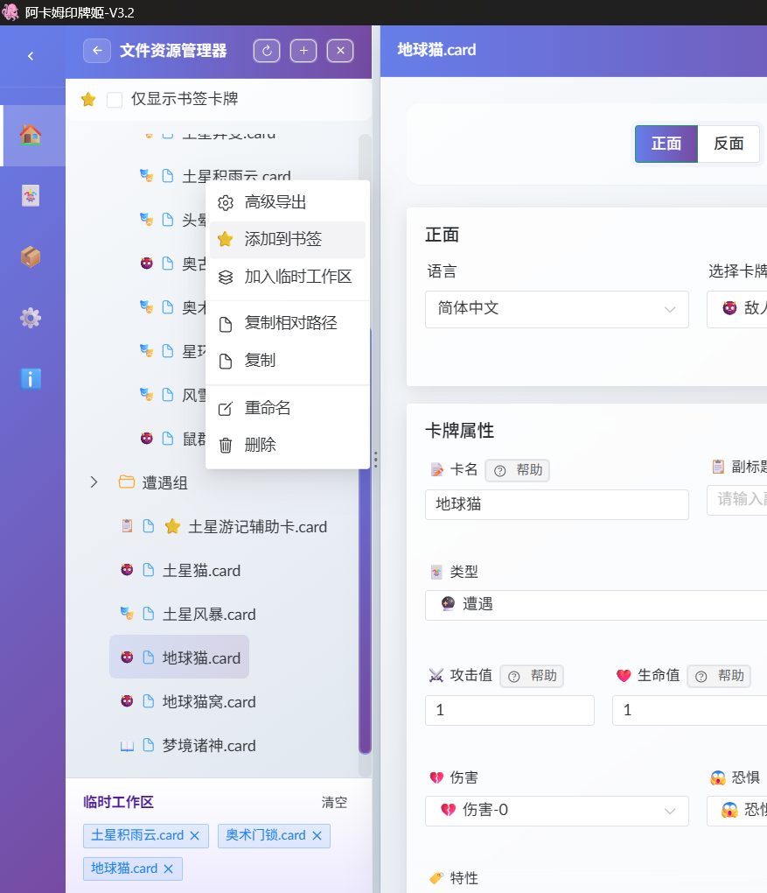

### 3.9 Double-Sided Cards, Mini Cards and Customizable Cards

- Mini investigator cards: bind the corresponding mini card in the `TTS Script` section.
- Customizable cards: bind the customizable card in `TTS Script`. ArkhamDB / TTS exports automatically merge upgrade options.

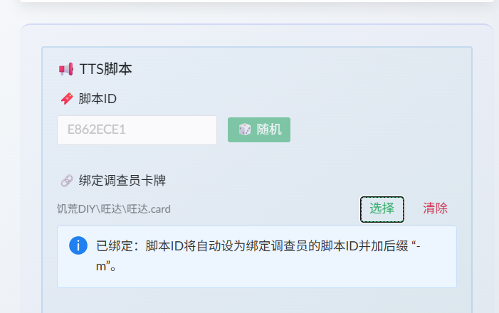

### 3.10 Customizable Card Editing

Tips:

- One upgrade option per line.
- Use `<upg>` or `<升级>` to mark unchosen options (XP cost is calculated automatically).

Example:

```text
<升级>Extra Ammunition (+2 ammo)
<升级>Rapid Reload (Fast)
<升级>Armor Piercing (+1 damage)
```

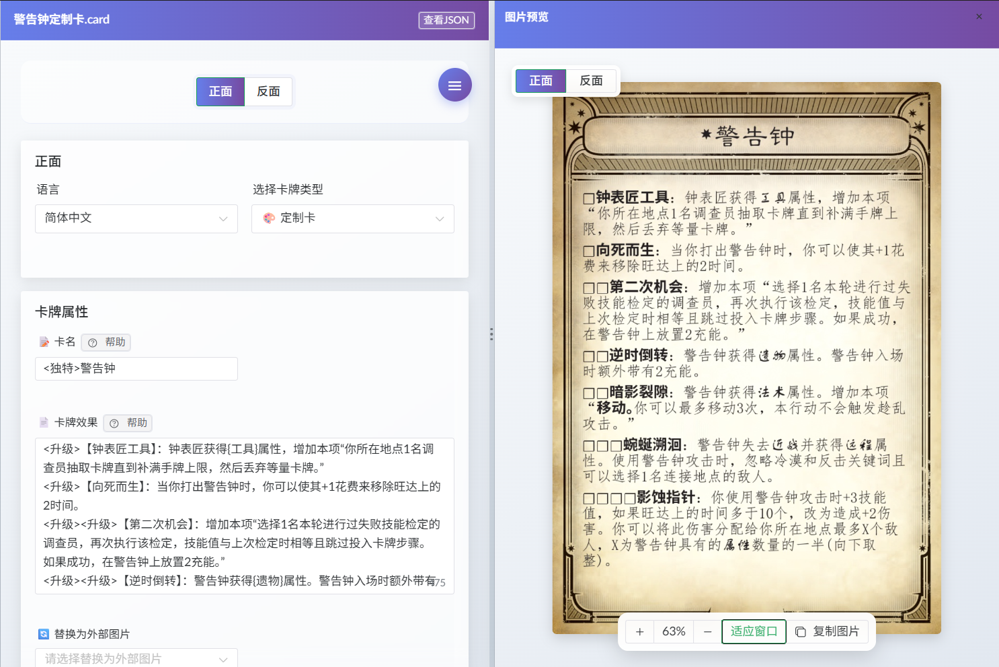

---

## 4. Content Packages

Content Packages are an efficient way to manage scenario or campaign cards in bulk. You can:

- Export all card images in a package.
- Generate a TTS module.
- Export to the arkham.build online deck builder.
- Generate PNP (Print and Play) PDFs.

### 4.1 Creating a Content Package

#### Method 1: From the Workspace

1. In the top navigation, click `Content Packages`.
2. Click `New Package`.
3. Fill in package info:
   - **Name**: for example, "Midnight Masks Campaign".
   - **Author**: your name.
   - **Version**: for example, `1.0`.
   - **Description**: a short description.
4. Select cards to include (drag from the file tree or multi-select).
5. Save as a `.pack` file.

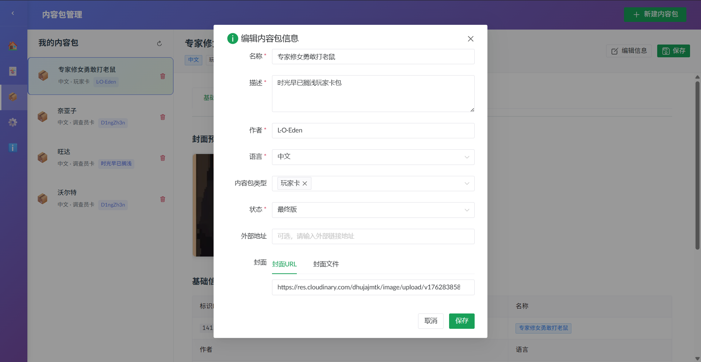

### 4.2 Adding and Managing Cards

When you open an existing Content Package, you can add or adjust cards in the **Card Management** view.

1. **Open the package**: in `Content Packages`, load the package you want to edit.
2. **Switch to card management**: go to the `Card Management` tab to see all cards currently included.
3. **Add cards**: click `Add Cards` to open the file picker.
   - You can multi-select files or select a whole folder; all cards inside will be added.
4. **Save changes**: after adjusting cards, remember to save the package.

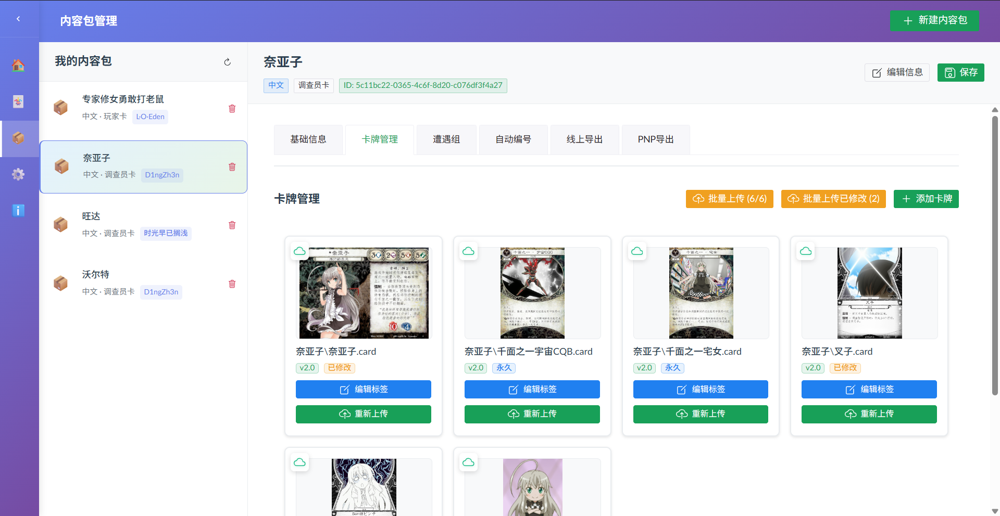

### 4.3 Uploading to an Image Host

For TTS, each card image needs a public HTTPS URL. The app can help you upload images to an image host.

#### Recommended Image Host: Cloudinary

1. Sign up for a free Cloudinary account (the free tier is usually enough).
   - Register at: https://cloudinary.com/users/register/free
2. In Arkham Card Maker, go to `Settings` → `Image Host`.
3. Fill in Cloudinary settings:
   - **Cloud Name**: shown on the Cloudinary dashboard home.
   - **API Key** and **API Secret**: found under `Settings` → `API Keys`.
   - **Upload Preset** (optional): to specify a folder or preset behavior.
4. Save the configuration.

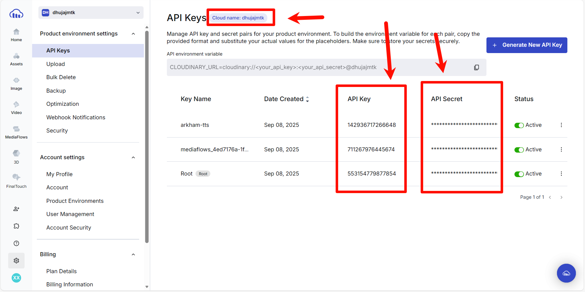

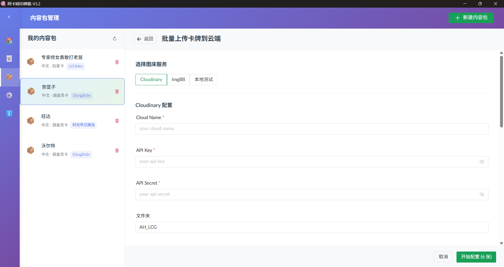

#### Uploading Images

1. Open your Content Package in the `Content Packages` page.
2. Click `Upload to Image Host`.
3. Choose which cards to upload (all are selected by default).
4. Click `Start Upload`.
5. After upload, each card will receive a public image URL.

Tips:

- The first full upload may take a while, depending on card count and network speed.
- Failed uploads are highlighted and can be retried individually.
- Uploaded URLs are stored back into the card configuration automatically.

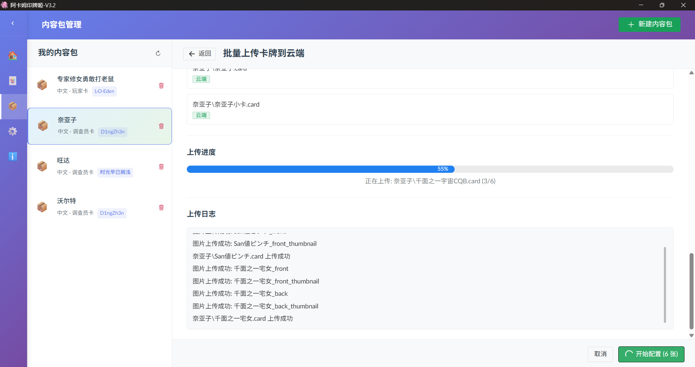

### 4.4 Auto Numbering

Auto Numbering helps you assign card numbers for scenarios and campaigns.

#### Numbering Rules

1. Open the Content Package.
2. Click `Generate Numbering Scheme`.
3. Configure numbering:
   - **Start number**: for example, `1` or `100`.
   - **Grouping**: by encounter set or by card type.
4. Click `Generate` to preview the result.
5. If it looks good, click `Apply Numbering`.

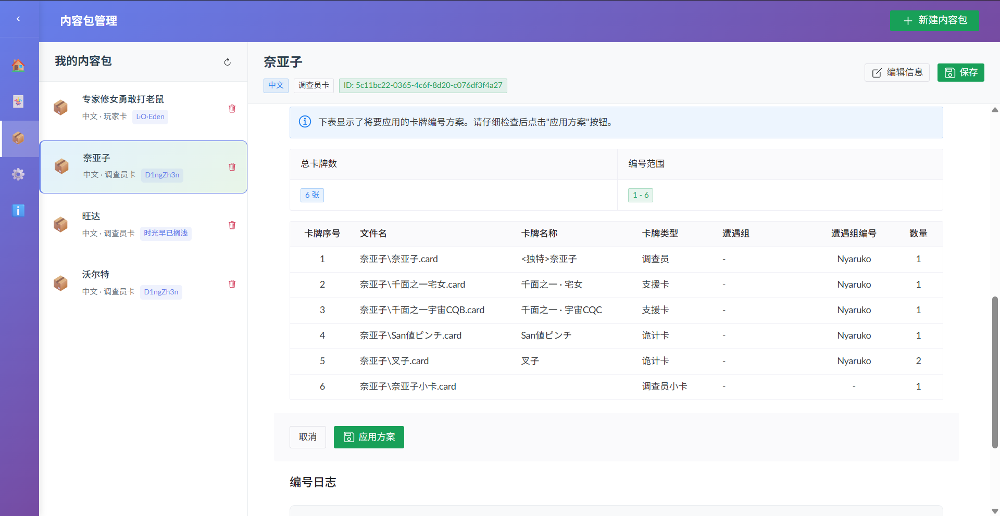

Typical uses:

- Sort cards by number in TTS.
- Make printed cards easier to organize.
- Fill card numbers correctly when exporting to ArkhamDB.

### 4.5 TTS Export

TTS Export generates a `.json` file that Tabletop Simulator can load as a saved object.

#### Export Steps

1. Make sure every card has an image URL (either uploaded or manually provided).
2. In the Content Package page, click `Export TTS`.
3. Configure TTS options:
   - **Box name**: the container name shown in TTS.
   - **Auto group**: automatically split into multiple decks by card type.
   - **Include script**: export Lua scripts for special behavior.
4. Click `Export` to generate the `.json` file.

#### Import into TTS

1. Copy the exported `.json` to:
   - Windows: `Documents\My Games\Tabletop Simulator\Saves\Saved Objects`
   - macOS: `~/Documents/My Games/Tabletop Simulator/Saves/Saved Objects`
2. Open Tabletop Simulator.
3. From the top menu, choose **Objects** → **Saved Objects**.
4. Refresh the list and load your custom package.


Notes:

- Image URLs must be public HTTPS addresses.
- Double-sided cards are handled automatically (front/back).

### 4.6 arkham.build Export

arkham.build is an online deck builder. After exporting, you can share your homebrew cards there.

#### Export Steps

1. Open the Content Package.
2. Click `Export to arkham.build`.
3. Configure options:
   - **Include image URLs**: if enabled, Cloudinary URLs are included.
   - **Compatibility mode**: keep the data format compatible with official Arkham cards.
4. Export a JSON file.

#### Import into arkham.build

1. Go to https://arkham.build.
2. Open **Settings** → **Community Content** → **Import from file**, and select the exported JSON file (usually named with `_arkhambuild.json`).
3. Your custom cards are now available online.

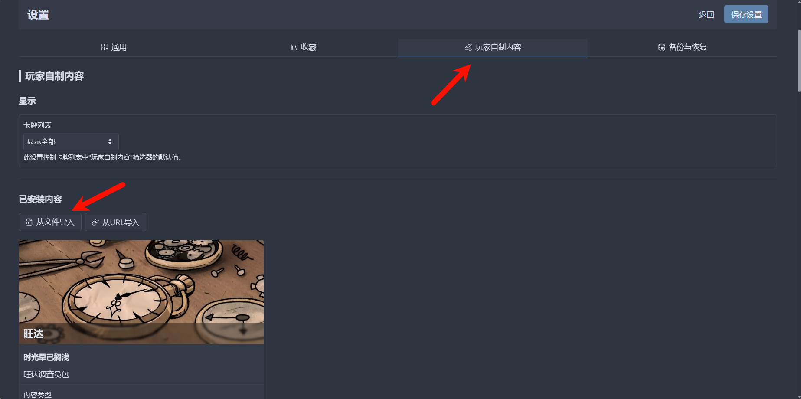

### 4.7 PNP Export

PNP (Print and Play) export generates PDFs optimized for printing, with multiple cards per page.

#### Export Steps

1. Open the Content Package.
2. Click `Export PNP`.
3. Configure print options:
   - **Paper size**: A4 / Letter / A3.
   - **Cards per page**: 9 cards (3×3) or 8 cards (2×4).
   - **Bleed marks**: show cut lines.
   - **Back side handling**: automatically generate matching back pages.
4. Click `Export` to generate the PDF.

#### Printing Tips

1. Use a color printer (laser recommended).
2. Enable **duplex printing** if your printer supports it.
3. Use 200–300 g/m² cardstock.
4. Cut along the lines.
5. Optional: use 61 × 88 mm sleeves.

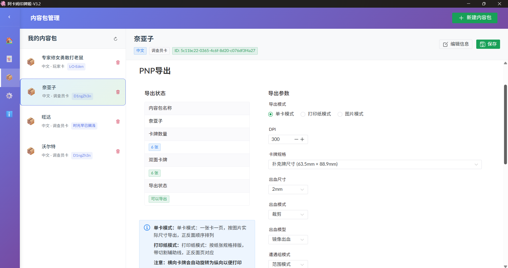


---

## 5. Advanced Features

### 5.1 TTS Script Configuration

TTS scripts (Lua) let your cards do more in Tabletop Simulator: auto-setup, counters, buttons and so on.

#### 5.1.1 Entry Marker Configuration

Use entry markers to put tokens on a card when it enters play (clues, resources, damage, horror, etc.).

Configuration path:

1. Open the card editor.
2. Expand the `TTS Config` section.
3. Find `Entry Markers`.
4. Add markers:
   - **Type**: clue / resource / damage / horror.
   - **Amount**: fixed number or an expression such as `1[per_investigator]`.
   - **Color**: token color.
5. Save the card.

Example JSON:

```json
{
  "id": "9286599D",
  "type": "Asset",
  "traits": "Item. Weapon. Melee.",
  "class": "Mystic",
  "cost": 3,
  "uses": [
    {
      "count": 3,
      "type": "Charge",
      "token": "resource"
    }
  ]
}
```

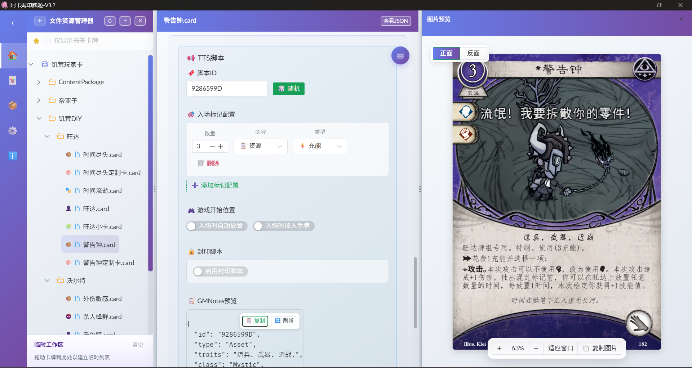

#### 5.1.2 Seal Script Configuration

Use seal scripts to let a card seal chaos tokens (for example, "Seal 1 Skull token").

Configuration path:

1. Open a card that supports sealing (for example, a protective charm).
2. Expand `TTS Config` → `Seal Script`.
3. Check `Enable Seal Script`.
4. Configure options:
   - **Allowed tokens**: multi-select (Skull, Cultist, Tablet, etc.).
   - **Max sealed tokens**: for example, `1` (leave empty for no limit).
   - **Allow any token**: if checked, any chaos token can be sealed (advanced use).
5. Save the card.

Available token types:

- Elder Sign
- Auto-fail
- Skull
- Cultist
- Tablet
- Elder Thing
- Bless
- Curse
- Frost

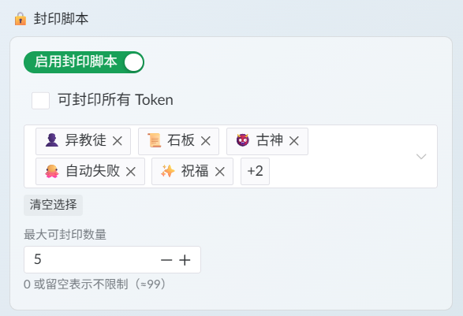

In TTS you can then:

- Right-click the card → `Seal Tokens`.
- Choose which tokens to seal.
- Right-click → `Release Tokens` when you want to put them back.
- Use `Resolve Tokens` for effects like Bless / Curse.

### 5.2 Deck Options (DeckOption)

DeckOptions control flexible deckbuilding rules for investigators, scenarios or special abilities.

#### 5.2.1 Simple Options

The simplest DeckOption just restricts which cards are allowed.

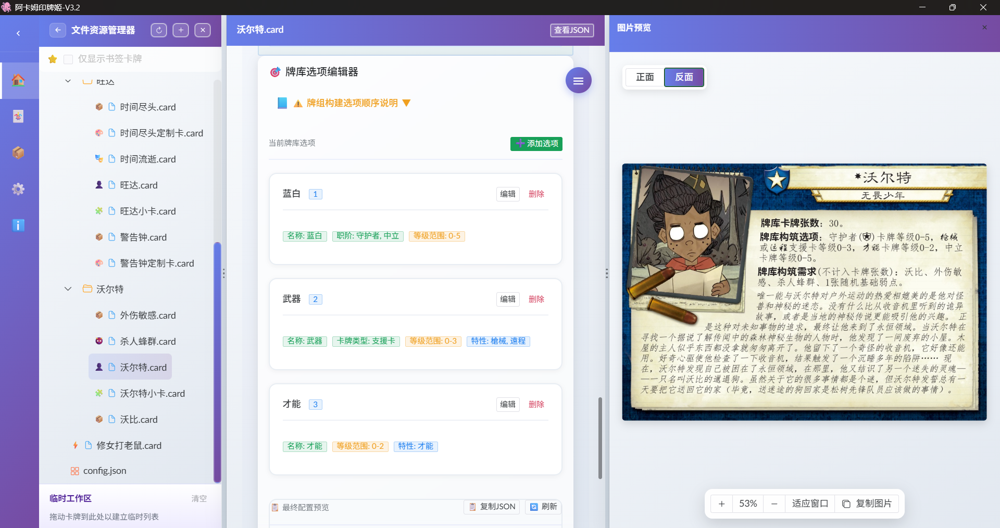

#### 5.2.2 Faction or Trait Choice

Allow players to choose among multiple factions or traits.

Typical uses:

- Multi-faction investigators.
- Scenario reward pools.

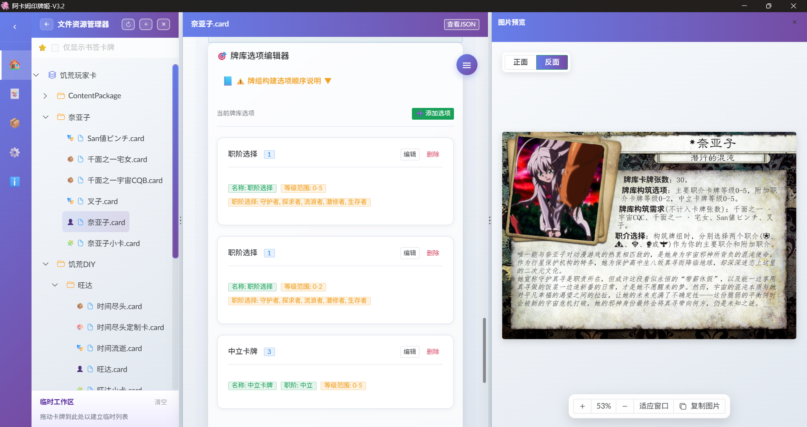

#### 5.2.3 Advanced Choices

Advanced options support more complex combinations, such as "choose 3 traits, up to 2 cards per trait".

Important fields:

- `trait_select`: choose traits.
- `option_select`: combine multiple sub-options (nested rules).
- `atleast`: require at least certain conditions.
- `not`: exclude conditions.

#### DeckOption Editor

On the `Deck Builder` page you can use a visual editor to configure DeckOptions:

1. Click `Add DeckOption`.
2. Choose the type (simple / faction choice / trait choice / advanced).
3. Fill in the form.
4. Preview the generated JSON.
5. Save.

### 5.3 Lama-Based AI Bleed

Lama Bleed uses an AI image extension service to add bleed areas around artwork so you can cut printed cards cleanly.

Configuration is done in the app settings and export helper; details depend on your Lama server setup. In short:

- Point Arkham Card Maker to a running Lama service.
- Choose the bleed mode in advanced export.
- The service extends artwork beyond the card frame before export.

For most users, the built-in non-AI bleed is already enough. Lama Bleed is for those who want the extra polish.

---

## 6. FAQ

### 6.1 File Scan Is Slow

**Symptom**: opening a workspace with 1000+ files feels slow.

**What the app already does**

The app uses progressive loading:

1. **Phase 1** (< 1 second): return directory structure quickly (folders and file names only).
2. **Phase 2** (background): scan card types and update icons.

Normally you do not need to do anything. If needed, you can tune it under `Settings` → `Performance`:

- Adjust `Scan batch size` (default: 200).
- Enable `Only scan visible files` (recommended).

**Organizing files for better performance**

Good folder layout helps a lot:

```text
Recommended:
workspace/
├── Investigators/          (< 50 files)
├── PlayerCards/           (< 200 files per subfolder)
│   ├── Guardian/
│   ├── Seeker/
│   └── ...
└── Scenarios/             (grouped by scenario)
    ├── Midnight Masks/    (< 100 files)
    └── The Devourer Below/

Avoid:
workspace/
└── AllCards/              (1000+ files, slow)
```

**Cache**

The app caches card-type info:

- Cache file: `.cache/card_types.json`.
- Only rescans when files change.
- You can manually refresh via file tree right-click → `Refresh Cache`.

### 6.2 Virtual List and Scrolling

**Symptom**: scrolling feels laggy with many files.

**Answer**: the file tree uses a virtual list (like `vue-virt-list`) so only visible nodes are rendered.

How it works:

- Only 20–30 visible nodes are rendered at a time.
- As you scroll, the visible window is updated.
- Memory usage stays stable.

Notes:

- After filtering by search, the virtual list rebuilds its index.
- Expanding/collapsing very large folders may still cause a short pause.

### 6.3 Layout Tips

**Tip 1: Focus on faces**

For portrait art:

1. Use `Scale` around 1.3–1.5.
2. Use `Crop` to remove borders.
3. Use `Offset` to move the face slightly upward.

**Tip 2: Balance text and art**

If text overlaps art too much:

1. Use the `Text Boundary Editor` to shrink the text region.
2. Or use the `Illustration Layout Editor` to shrink the image.
3. Aim for both readability and visuals.

**Tip 3: Multilingual layouts**

Chinese text usually takes more space than English:

- Slightly reduce font size for Chinese cards (under `Settings`).
- Or adjust text boundaries to give text more room.

### 6.4 App Won't Start

**Possible cause 1: Antivirus blocking**

- Add the app to your antivirus allowlist.
- Or temporarily disable real-time protection and try again.

**Possible cause 2: Missing runtime (Windows)**

- Install the Visual C++ Redistributable: https://aka.ms/vs/17/release/vc_redist.x64.exe

**Possible cause 3: Port conflict**

- The app uses port `5000` by default. If it is taken, start with another port, for example:

  ```bash
  Arkham Card Maker.exe --port 5001
  ```

### 6.5 Exported Images Look Blurry

Try this:

1. In export settings, set `DPI` to 300 for print.
2. Choose `PNG` (lossless).
3. Make sure the original illustration is high enough resolution (at least 1500×2100 pixels).
4. Avoid over-scaling images (scale > 2.0 tends to blur).

### 6.6 TTS Import Looks Wrong

Common issues:

- **No images**: check that image URLs are HTTPS and publicly reachable.
- **Wrong card size**: make sure you chose the correct card type (standard / horizontal / investigator).
- **No back side**: ensure the card is configured with an independent back.

Debug steps:

1. Open the image URL in a browser.
2. Check TTS logs under `%USERPROFILE%\Documents\My Games\Tabletop Simulator\Logs\`.
3. Try exporting and importing again.

### 6.7 Backing Up Your Workspace

**Option 1: Manual backup**

- Copy the whole workspace folder to another location (cloud drive, external disk, etc.).

**Option 2: Version control (for developers)**

1. Initialize a Git repo in your workspace:

   ```bash
   cd your-workspace
   git init
   git add .
   git commit -m "initial backup"
   ```

2. After important changes:

   ```bash
   git add .
   git commit -m "update cards"
   ```

Suggested backup frequency:

- After finishing an important card.
- After finishing a scenario.
- At least once per week.

### 6.8 Getting More Help

**Official resources**

- GitHub repo: https://github.com/xziying44/arkham-homebrew
- Issue tracker: https://github.com/xziying44/arkham-homebrew/issues
- Changelog: see the `About` page in the app.

**Community**

- QQ group: 441317092
- Discord channel: https://discord.com/channels/225349059689447425/1409199111994867903

---

Thanks for using Arkham Card Maker, and happy brewing!

If you find this project helpful, consider starring it on GitHub.

If you run into problems or have ideas, feel free to open an issue or join the community chat.

